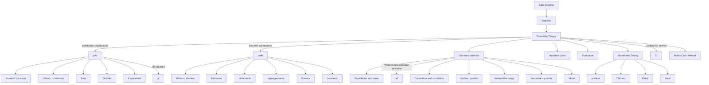

# AI Engineering Roadmap

This roadmap will guide you through the key principles and knowledge needed to embark on the exciting journey of AI engineering.
There are four main sections for this journey:

1. **Fundamentals**
2. **Data Science**
3. **Machine Learning**
4. **Deep Learning**

## Fundamentals

In the Fundamentals section, we cover the essential building blocks of AI engineering:

```mermaid
flowchart TD
    A[Fundamentals] --> B[Basics]
    B --> C[Matrices & Linear Algebra Fundamentals]
    B --> D[Database Basics]
    B --> E[Tabular Data]
    B --> F[Data Frames & Series]
    B --> |ETL| G[Extract, Transform, Load]
    B --> H[Reporting vs BI vs Analytics]
    B --> I[Data Formats]
    B --> |RegEx| J[Regular Expressions]
    D --> K[Relational vs. non-relational databases]
    D --> L[SQL + Joins, for example Inner, Outer, Cross, Theta Join]
    D --> M[NoSQL]
    I --> N[JSON]
    I --> O[XML]
    I --> P[CSV]
    A[Fundamentals] -->|Python Programming| B1[Python Programming]
    B1 --> C1[Python Basics]
    B1 --> D1[Important libraries]
    B1 --> E1[Virtual Environments]
    B1 --> F1[Jupyter Notebooks/Lab]
    C1 --> G1[Expressions]
    C1 --> H1[Variables]
    C1 --> I1[Data Structures]
    C1 --> J1[Functions]
    C1 --> K1[Install packages via pip, conda or similar]
    C1 --> L1[Codestyle, e.g. PEP8]
    D1 --> M1[Numpy]
    D1 --> N1[Pandas]
    A[Fundamentals] -->|Data Sources| B2[Data Sources]
    B2 --> C2[Data Mining]
    B2 --> D2[Web Scraping]
    B2 --> E2[Awesome Public Datasets]
    B2 --> F2[Kaggle]
    A[Fundamentals] -->|Exploratory Data Analysis / Data Munging / - Wrangling| B3[Exploratory Data Analysis / Data Munging / - Wrangling]
    B3 --> |PCA| C3[Principal Component Analysis]
    B3 --> D3[Dimensionality & Numerosity Reduction]
    B3 --> E3[Normalization]
    B3 --> F3[Data Scrubbing, Handling Missing Values]
    B3 --> G3[Unbiased Estimators]
    B3 --> H3[Binning sparse values]
    B3 --> I3[Feature Extraction]
    B3 --> J3[Denoising]
    B3 --> K3[Sampling]
```

In the Data Science section, we cover the essential building blocks of workign with data:

